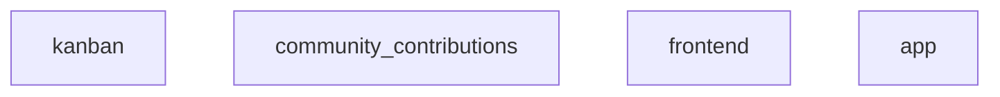
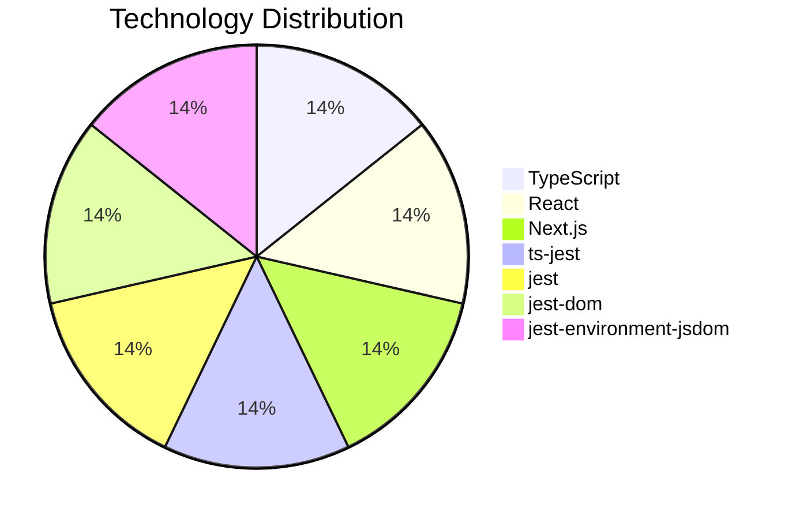

# Project Documentation

## Overview

## Architecture

## Tech Stack

## Entry Points

- `/Users/mac/Desktop/Project/kanban/frontend/src/app/layout.tsx`
- `/Users/mac/Desktop/Project/kanban/frontend/src/app/page.tsx`

## Modules

### kanban

# Project Documentation

## Overview

## Tech Stack

- **Language**: TypeScript
- **Framework**: Next.js, React
- **Testing**: jest-dom, ts-jest, jest-environment-jsdom, jest

## Entry Points

- `/Use

**Files:**
- `AGENTS.md`
- `README.md`

### community_contributions

**Files:**
- `ED_DONNER_AGENTS.md`
- `mluck134.md`

### frontend

This is a [Next.js](https://nextjs.org) project bootstrapped with [`create-next-app`](https://nextjs.org/docs/app/api-reference/cli/create-next-app).

## Getting Started

First, run the development se

**Files:**
- `AGENTS.md`
- `CLAUDE.md`
- `README.md`
- `eslint.config.mjs`
- `jest.config.js`
- `jest.setup.js`
- `next-env.d.ts`
- `next.config.ts`
- `package.json`
- `postcss.config.mjs`

### app

**Files:**
- `globals.css`
- `layout.tsx`
- `page.test.tsx`
- `page.tsx`

---

*Documentation generated by DocGenius*
